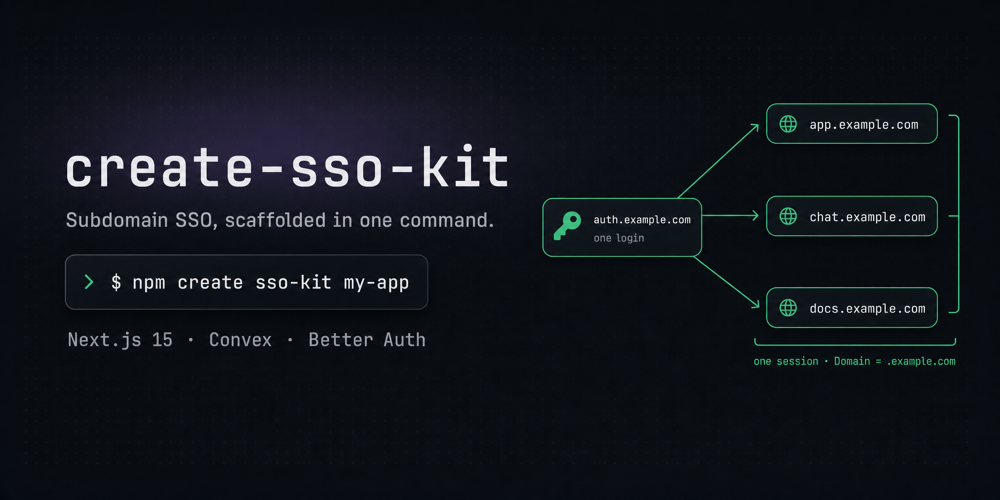

<p align="center">
  
</p>

[English](README.md) · [한국어](README.ko.md)

# create-sso-kit

[](https://www.npmjs.com/package/create-sso-kit)
[](LICENSE)

Scaffold a **subdomain single sign-on** starter — [Next.js 15](https://nextjs.org) + [Convex](https://convex.dev) + [Better Auth](https://better-auth.com) — and let your AI coding agent finish the setup for you. One `create` command drops a working monorepo into a new folder; your existing Claude Code or Codex session then reads the bundled runbook and walks you through the human-only parts (the Convex login, the dev-domain choice) until SSO is verified end to end.

## What is this?

`create-sso-kit` is a **thin scaffolder paired with a thick runbook**. The CLI does deterministic file operations only: it fetches the pinned [`sso-kit`](https://github.com/NewTurn2017/sso-kit) template tarball, extracts it into a new project, customizes a couple of files, re-inits git, and prints a one-line next step. It installs nothing, touches no environment variables, and contains no embedded LLM.

The decision-heavy and human-only parts of setup — `pnpm install`, the interactive Convex login, the four `convex env set` values, each app's `.env.local`, the dev-domain choice, and the run/verify pass — live in a runbook (`SETUP.md`) that ships *inside* the scaffolded project. **Your existing coding agent executes that runbook step by step**, pausing to ask you only where it must. The agent is the one you already run; the CLI just gets the code onto disk and points the agent at the instructions.

## When to use it

This kit is built for **multiple apps that live on subdomains of one shared parent domain and want a single login**. Good fits:

- A product app plus a marketing site plus docs — `app.example.com`, `www.example.com`, `docs.example.com` — that should all recognize one signed-in user under one brand.
- A central sign-in portal (`auth.example.com`) fronting several consumer apps (`chat.example.com`, `notes.example.com`, …) where logging in once signs you into all of them.
- A suite of internal tools on subdomains that should share one session and one **instant** logout.
- You want central login + central logout with **~zero custom auth code**: the kit gets this from Better Auth's `crossSubDomainCookies` + a single shared Convex deployment, not from a hand-rolled auth service.
- You want a "clone and it runs" starter whose remaining setup is guided by your agent rather than a 12-page manual.

### When NOT to use it / non-goals

These are deliberate scope decisions — the first four are recorded in the kit's architecture record; the last is design rationale. If you need one of these, look elsewhere:

| If you need… | Why this kit isn't it |
|---|---|
| **SSO across different root domains** (`brandA.com` ↔ `brandB.io`) | Explicitly out of scope in v1. The cookie mechanism only spans subdomains of one shared parent. Cross-root-domain is, at best, a conditional v2 item pending Better Auth's OAuth Provider Plugin. |
| **To *be* an OIDC / OAuth / SAML identity provider** for third parties (issue tokens to outside apps) | Not a goal. The `oidcProvider` route was rejected (vendor flagged it for deprecation and "may not be suitable for production use"); `@better-auth/sso` consumes external IdPs and is incompatible with the Convex integration. |
| **A self-hosted auth microservice** with its own `/sessions` API + Redis | Deliberately not built. That reinvents what Better Auth + Convex already provide and forces you to maintain security-sensitive session code in a public starter. |
| **Stateless JWT sessions**, or **per-app independent Convex deployments** that phone home | Rejected designs. Logout propagation with stateless JWTs is hard, and cross-deployment auth is outside the component's official support. The kit uses one shared Convex deployment as the central session store. |
| **A single standalone app** | Overkill. The cross-subdomain cookie machinery, the login-portal redirect middleware, and the shared-deployment wiring only pay off with 2+ apps. (Design rationale, not a recorded ADR decision.) |

## Prerequisites

A few tools before you start (full list in [Requirements](#requirements)):

- **A coding agent** — [Claude Code](https://docs.anthropic.com/en/docs/claude-code) or [Codex](https://github.com/openai/codex), installed and signed in. It reads the bundled `SETUP.md` and runs steps 2–8 for you. *No agent? Follow the [Full walkthrough](#full-walkthrough) by hand — it mirrors `SETUP.md`.*
- **pnpm 10** — `corepack enable` (ships with Node) pins it; or see [pnpm.io](https://pnpm.io). Needed for `pnpm install`, `pnpm dev:auth`, `pnpm dev:chat`.
- **Node ≥ 18.18** (Node 20 LTS recommended) for the scaffolded Next.js 15 apps; Node ≥ 18 suffices for the CLI itself.
- **A free [Convex](https://convex.dev) account** — the agent guides the interactive login.

## Quick start

```bash
pnpm create sso-kit my-app
# or:  npm  create sso-kit@latest my-app
# or:  npx  create-sso-kit my-app
```

Then hand the rest to your agent:

```bash
cd my-app
claude          # or: codex
```

The agent reads `AGENTS.md` / `CLAUDE.md`, finds `SETUP.md`, and walks you through configuring the kit — stopping at the Convex login and the dev-domain choice for your input.

**No agent?** You can run the kit by hand — follow the [Full walkthrough](#full-walkthrough) below, which mirrors `SETUP.md`.

If you omit the project name, the CLI prompts for it once (`Project name: `) before scaffolding.

## Full walkthrough

An end-to-end run, from empty folder to verified SSO.

### 1. Scaffold (the CLI, ~seconds)

```bash
pnpm create sso-kit my-app
```

The CLI prints its progress with the project name resolved from your input:

```
Scaffolding my-app from sso-kit@v0.1.3…

✅ Created my-app.

Next: cd my-app && claude   (or codex)
Your agent will walk you through setup via SETUP.md (it'll use pnpm).
```

Under the hood it downloads `https://github.com/NewTurn2017/sso-kit/archive/refs/tags/v0.1.3.tar.gz`, strips the archive's top-level directory so files land directly in `my-app/`, sets the root `package.json` `name` to the npm-safe slug, replaces the `{{PROJECT_NAME}}` token in `SETUP.md` with your directory name, and re-initializes git as a single commit on branch `main`. If `git` isn't on your `PATH`, it skips that step and tells you so — scaffolding still succeeds:

```
note: git wasn't initialized — install git and run "git init" in my-app.
```

### 2. Hand it to your agent

```bash
cd my-app
claude          # or: codex
```

On entry the agent reads `CLAUDE.md` / `AGENTS.md` (byte-identical pointers) and is told: if `apps/*/.env.local` don't exist yet, follow `SETUP.md` one step at a time.

### 3. The agent runs `SETUP.md` (with two human-only gates)

`SETUP.md` is an 8-step runbook written *for* the agent. It does every step it can and **pauses at the steps marked 🚦 HUMAN-ONLY**:

| Step | What happens | Who |
|---|---|---|
| 1. Greet & orient | Agent explains the flow and warns about the two pauses. | agent |
| 2. Install deps | `pnpm install`, confirm it finishes clean. | agent |
| 3. Connect Convex | 🚦 **You** run `cd packages/backend && npx convex dev` — browser login, create/select a project, leave it running. The agent then reads `CONVEX_URL` / `CONVEX_SITE_URL` from `packages/backend/.env.local`. It will **never fabricate a deployment URL**. | 🚦 human, then agent |
| 4. Dev-domain choice | 🚦 The agent proposes `lvh.me` and **asks you** to confirm or give a custom shared parent `<DOMAIN>`. Origins derive as `http://auth.<DOMAIN>:3000` and `http://chat.<DOMAIN>:3001`. | 🚦 human |
| 5. Set Convex env vars | From `packages/backend/`, the agent sets four deployment vars: `BETTER_AUTH_SECRET` (idempotent, via `openssl rand -base64 32`), `SITE_URL`, `COOKIE_DOMAIN`, `TRUSTED_ORIGINS`. | agent |
| 6. Write each app's `.env.local` | Copies `.env.example` → `.env.local` for both apps and fills `NEXT_PUBLIC_CONVEX_URL` / `NEXT_PUBLIC_CONVEX_SITE_URL` (same deployment for both); rewrites the origin lines if you chose a custom domain. | agent |
| 7. Run & verify | Starts `pnpm dev:auth` and `pnpm dev:chat`, runs the G3 smoke test, then guides browser verification. | agent + you |
| 8. Optional publish | Offers to push to GitHub — only if you say yes. | agent |

With the default `lvh.me`, Step 5 resolves to:

```bash
# in packages/backend/  (convex dev still running in another terminal)
# idempotent: only sets BETTER_AUTH_SECRET if it isn't already set, so re-running never rotates it
test -n "$(npx convex env get BETTER_AUTH_SECRET 2>/dev/null)" || npx convex env set BETTER_AUTH_SECRET "$(openssl rand -base64 32)"
npx convex env set SITE_URL          http://auth.lvh.me:3000
npx convex env set COOKIE_DOMAIN     lvh.me
npx convex env set TRUSTED_ORIGINS   http://auth.lvh.me:3000,http://chat.lvh.me:3001
```

> No `openssl`? Any 32+ character random string works — e.g. `node -e "console.log(require('crypto').randomBytes(32).toString('base64'))"`.

> `BETTER_AUTH_SECRET` must be set **before** the first sign-up, and the guarded command above sets it idempotently so re-running setup never rotates it. Better Auth encrypts its JWKS signing key with this secret — see Troubleshooting if you ever change it.

And Step 6 copies each app's env file and fills two keys in each (the same Convex deployment for both apps):

```bash
# from the repo root
cp apps/auth/.env.example apps/auth/.env.local
cp apps/chat/.env.example apps/chat/.env.local
# in each .env.local, set (values read from packages/backend/.env.local):
#   NEXT_PUBLIC_CONVEX_URL       = CONVEX_URL
#   NEXT_PUBLIC_CONVEX_SITE_URL  = CONVEX_SITE_URL
# then rewrite the origin lines if you chose a custom domain.
```

The precise commands live in `SETUP.md` Step 6 and can be followed by hand.

### 4. Run both apps on `lvh.me`

Three terminals, all alive at once:

```bash
# packages/backend/
npx convex dev          # the shared central session store

# repo root
pnpm dev:auth           # → http://auth.lvh.me:3000   (login portal)
pnpm dev:chat           # → http://chat.lvh.me:3001   (demo consumer)
```

`lvh.me` is public DNS that resolves to `127.0.0.1`, so `auth.lvh.me` and `chat.lvh.me` are real subdomains of a shared parent with **no `/etc/hosts` editing**.

### 5. Verify SSO (the G1–G4 gates)

The kit has been verified on the real stack (two Next.js dev servers + a live Convex deployment + Better Auth) in a real Chrome profile. All four gates pass:

| Gate | Guarantee | How it's checked |
|---|---|---|
| **G3** unauthenticated redirect | `GET chat.lvh.me:3001/protected` with no session → `auth.lvh.me:3000/login?redirect=<original-url>` | Headless: `curl -sI http://chat.lvh.me:3001/protected \| grep -i '^location:'` should point at `…/login?redirect=…` (or just open the URL in a browser and watch the redirect) |
| **G1** cross-subdomain session | Sign up on `auth` → the `chat` protected page shows your email, and the `auth` login page also renders as authenticated. One session, both subdomains. | Browser |
| **G2** central logout | `signOut()` on `chat` → `auth` returns to its login form and `chat` is immediately blocked again. | Browser |
| **G4** cookie domain / CSRF | `Set-Cookie: better-auth.session_token=…; Domain=lvh.me; HttpOnly; SameSite=Lax`. Requests with no `Origin` header are rejected `403`. | `curl` / DevTools |

After G3 passes, a human in a real browser does the rest of the round trip: sign up at `http://auth.lvh.me:3000/login` (sign-up is open) → open `http://chat.lvh.me:3001/protected` and see your email → confirm `auth.lvh.me` now shows you as signed in → log out and watch both apps drop. The full click path is `SETUP.md` Step 7.

## What you get

A pnpm + Turborepo monorepo (`sso-kit-poc`) demonstrating subdomain SSO with one login and one session across all subdomains:

```
my-app/
├─ apps/
│  ├─ auth/            @sso-kit/auth  — central sign-in portal (port 3000, auth.lvh.me)
│  │   ├─ app/login/                  email + password form
│  │   └─ app/api/auth/[...all]/      same-origin proxy → shared Convex
│  └─ chat/            @sso-kit/chat  — demo consumer (port 3001, chat.lvh.me)
│      ├─ app/protected/              guarded route showing the signed-in email
│      ├─ middleware.ts               redirects unauthenticated → auth/login
│      └─ app/api/auth/[...all]/      its OWN same-origin proxy
├─ packages/
│  └─ backend/         @sso-kit/backend — single Convex deployment = central session store
│      └─ convex/                     auth.ts (Better Auth), http.ts, convex.config.ts, rotateKeys
├─ SETUP.md            the agent runbook (8 steps, 🚦 human-only gates)
├─ AGENTS.md / CLAUDE.md   thin pointers: "follow SETUP.md"
└─ docs/               architecture-decision.md, poc-verification*.md, architecture-diagram.html
```

**How the single session works.** Better Auth runs *inside* Convex. `createAuth()` enables `advanced.crossSubDomainCookies` with `domain` set from `COOKIE_DOMAIN` (`lvh.me` in dev), so the session cookie is scoped to the shared parent domain and every subdomain reads the same session. Both apps point `NEXT_PUBLIC_CONVEX_URL` / `NEXT_PUBLIC_CONVEX_SITE_URL` at the **same** deployment. Each app keeps cookies first-party by proxying its **own** `/api/auth/[...all]` route to that shared deployment — same-origin, no CORS.

**Pinned versions** (quote these when filing issues):

| | Version |
|---|---|
| Next.js | `^15.5.0` |
| React / React-DOM | `^19.1.0` |
| Convex | `^1.25.0` |
| `@convex-dev/better-auth` | `0.12.2` (exact pin — 0.x, pre-1.0) |
| `better-auth` | `~1.6.9` |
| Tailwind CSS | `^4.1.13` (`@tailwindcss/postcss`) |
| TypeScript | `^5.9.0` |
| Geist / clsx / tailwind-merge | `^1.5.1` / `^2.1.1` / `^3.3.1` |
| pnpm | `10.33.0` (pinned via `packageManager`) |
| Turbo | `^2.6.0` |

UI is a small shadcn-style kit (auth: `button`, `card`, `input`, `label`; chat: `button`, `card`) with Tailwind v4 and the Geist font. Email + password auth uses `better-auth/react`'s `createAuthClient` with the `convexClient()` plugin. The repo also bundles Convex agent skills under `.agents/skills` / `.claude/skills`.

## What the CLI does (and doesn't)

**Does** (deterministic file ops only):

1. Downloads the `sso-kit` template at the pinned tag (override with `--ref`).
2. Extracts it into `my-app/` (strips the archive's top-level directory).
3. Sets the root `package.json` `name` to the npm-safe slug, and replaces `{{PROJECT_NAME}}` in `SETUP.md` with your directory name.
4. Re-initializes git (`git init -b main`) as a single initial commit. Wrapped in try/catch — if git is missing, scaffolding still succeeds and it prints a note.
5. Prints next-step guidance.

**Does NOT**: install dependencies (no `node_modules`), log in to Convex, set environment variables, write `.env.local` (`.env.example` is preserved as-is), choose a domain, run, or verify anything. All of that lives in the runbook and is performed by your agent — see [`sso-kit/SETUP.md`](https://github.com/NewTurn2017/sso-kit/blob/main/SETUP.md).

> Note: `--pm` does **not** install anything — it only changes the hint text `(it'll use <pm>)`. The CLI never runs pnpm/npm/yarn.

> Slug nuance: the directory name is kept verbatim (case preserved) and `{{PROJECT_NAME}}` in `SETUP.md` gets that name, while `package.json` `name` is lowercased to an npm-safe slug. So `My-App` → directory `My-App`, package name `my-app`, and `SETUP.md` reads `My-App`.

## Flags

`create-sso-kit <project-name>` — parsed with `node:util` `parseArgs` (no flags beyond these):

| Flag | Description | Default |
|---|---|---|
| `[project-name]` | Positional; the target directory (verbatim) and, lowercased, the package name. Prompted once if omitted. | — (prompted) |
| `--ref <tag>` | The `sso-kit` git tag to scaffold from. | `v0.1.3` |
| `--pm <pnpm\|npm\|yarn>` | Package manager named in the printed hint only. Invalid values throw `--pm must be one of pnpm\|npm\|yarn (got "<x>")`. | auto-detected from `npm_config_user_agent`, else `pnpm` |

**Project-name validation.** The name is trimmed and rejected if: empty/whitespace (`Project name is required.`); exactly `.` or `..`; it contains a path separator (`/` or `\`); it starts with a dot; the derived slug is empty; or the slug exceeds 214 chars (npm max). `create-sso-kit` also refuses to scaffold into an existing **non-empty** directory: `Target directory "<dir>" already exists and is not empty.`

**Errors.** Any thrown error is printed as `✖ <message>` to stderr with exit code `1`.

## Troubleshooting

| Symptom | Cause | Fix |
|---|---|---|
| After sign-up you're bounced straight back to login; SSO silently fails. | You used `*.localhost`. Chrome does **not** share cookies across `*.localhost` subdomains (even though `Set-Cookie … Domain=localhost` is emitted). | Use `lvh.me`. `COOKIE_DOMAIN=lvh.me` with `auth.lvh.me` / `chat.lvh.me` passes G1–G4 with the same code (Chrome stores it as `Domain=.lvh.me`). This is the kit's default and needs no `/etc/hosts` edits. |
| `auth.lvh.me` / `chat.lvh.me` don't resolve at all (the connection fails before any app loads). | `lvh.me` relies on external DNS (it resolves to `127.0.0.1`); DNS-rebind protection, some corporate resolvers, or being fully offline can block it. | Add `127.0.0.1 auth.lvh.me chat.lvh.me` to `/etc/hosts`, or use another loopback-wildcard domain. |
| The unauthenticated redirect points at `0.0.0.0`. | Under `next dev -H 0.0.0.0`, `request.url`'s host becomes `0.0.0.0`. | Already fixed in the kit: the middleware derives its return URL from the `Host` header / env, not from `request.url`. |
| Visiting the login page while logged out returns `500`. | `getCurrentUser` throws when there's no session. | Already fixed in the kit: it uses the component's null-safe path. |
| Auth calls fail with a CORS preflight block. | An app's `authClient` called the auth origin directly. | Each app's `authClient` must hit its **own** same-origin `/api/auth` proxy. This first-party boundary is a core rule of the architecture. |
| After adding a workspace package, the dev server throws Next chunk `404`s / hydration failures. | The dev server was started without re-running `pnpm install`. | `rm -rf .next && pnpm install`, then restart. |
| `GET /api/auth/convex/token` → `Failed to decrypt private key`. | Better Auth encrypts its JWKS key with `BETTER_AUTH_SECRET`; the deployment's secret was changed or reused with a different one. | Clear the betterAuth component's `jwks` table (Convex dashboard) **or** run `npx convex run auth:rotateKeys`. |
| `Target directory "<dir>" already exists and is not empty.` | You scaffolded into a folder that already has files. | Pick a fresh name or empty the directory. |
| `git wasn't initialized` note after scaffolding. | `git` isn't on your `PATH`. | Scaffolding still succeeded; install git and run `git init` in the project. |

## How it's designed

A **thin CLI** paired with a **thick runbook** — and the split is intentional:

- **This CLI** only scaffolds files from a pinned template tag. No logic about Convex, env, or domains. Keeping it tiny means there's almost nothing to break or maintain.
- **The runbook** (`SETUP.md`, shipped inside `sso-kit`) carries the real setup procedure, written as agent instructions with explicit human-only gates. It mirrors the kit's README "Quick start", so the two never drift.
- **The agent is the one you already run** — your Claude Code or Codex session reading the runbook, not an LLM embedded in the CLI. That means no extra API key or cost, it reuses your existing flow, and it avoids reimplementing an agent loop. Getting a fresh clone running inherently needs human or decision-heavy steps (the interactive Convex login, four env values, per-app `.env.local`, a domain choice, a run/verify pass) — so those are delegated rather than scripted.
- **The runbook is useful even without the CLI**: a plain `git clone` plus opening Claude/Codex in the repo triggers the same guided procedure.

This keeps the CLI minimal and the setup knowledge in one place, right next to the code it configures.

## Requirements

- **A coding agent** — [Claude Code](https://docs.anthropic.com/en/docs/claude-code) or [Codex](https://github.com/openai/codex), installed and authenticated. The whole guided flow is built around it: the agent reads `SETUP.md` and performs steps 2–8. (You can also run the kit by hand via the [Full walkthrough](#full-walkthrough).)
- **Node ≥ 18** to run the CLI (relies on global `fetch`, `node:util` `parseArgs`, and `Readable.fromWeb`).
- **Project: Node ≥ 18.18** (Node 20 LTS recommended) for Next.js 15 — no `package.json` declares an `engines` field, so Node 18.0–18.17 fails at `pnpm dev` rather than with a clear version error.
- For the scaffolded project: [pnpm](https://pnpm.io) 10 (run `corepack enable` to get it) and a free [Convex](https://convex.dev) account (the agent guides this).
- **`openssl`** for `BETTER_AUTH_SECRET` in Step 5 — optional; any 32+ char random string works (see the Node fallback in the walkthrough).
- For verification: a **Chromium-based browser** (the cross-subdomain cookie behavior is verified on Chrome) and **`curl`** for the headless G3 check.

## Development

```bash
pnpm install
pnpm test        # node:test suite via tsx (offline; uses a fixture tarball)
pnpm typecheck   # tsc --noEmit over src + test
pnpm build       # tsc → dist/ (published artifact)
pnpm dev         # tsx src/cli.ts  (run the CLI from source)
```

Tests run fully offline: they build a fixture `.tar.gz` and point the CLI at it via the `CREATE_SSO_KIT_TEMPLATE_TGZ` environment variable (a local-template seam), so no network is used. Unset, the CLI fetches the live GitHub tag tarball.

Single runtime dependency: `tar` (`^7.4.3`). Everything else is the Node standard library (`fetch`, `parseArgs`, `node:readline/promises`, `node:child_process`, `node:stream`).

Project layout:

```
src/
  args.ts        # CLI argument parsing (--ref, --pm, positional)
  validate.ts    # project-name validation + npm-safe slug
  customize.ts   # package.json name + SETUP.md {{PROJECT_NAME}} injection
  template.ts    # tag tarball URL + download/extract (strip top-level dir)
  scaffold.ts    # orchestrator (injectable IO for offline tests)
  prompt.ts      # one-shot readline prompt when the name is omitted
  cli.ts         # entry point + next-step guidance
test/            # a test file for each core module + a real-bin CLI test (also covers the prompt path)
```

## License

[MIT](LICENSE) © 2026 NewTurn2017